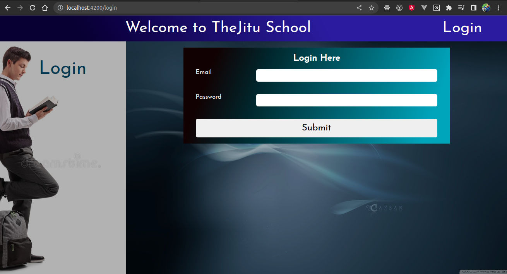
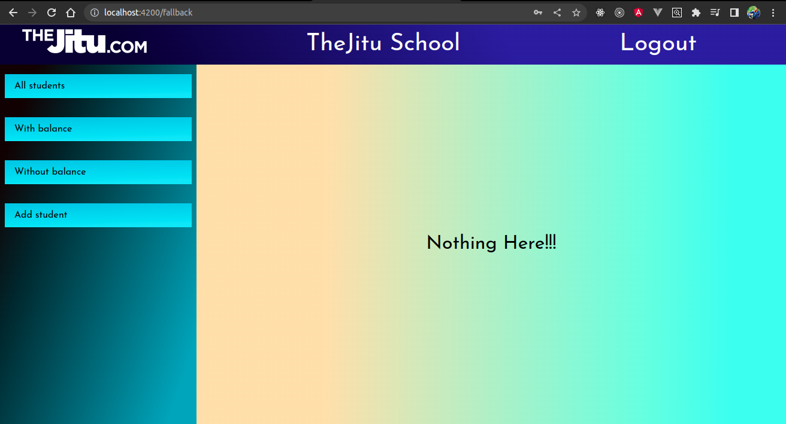
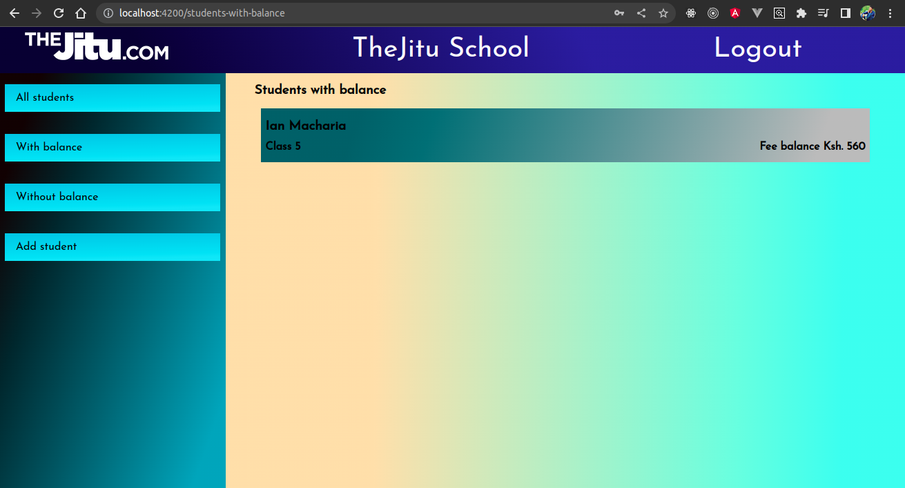
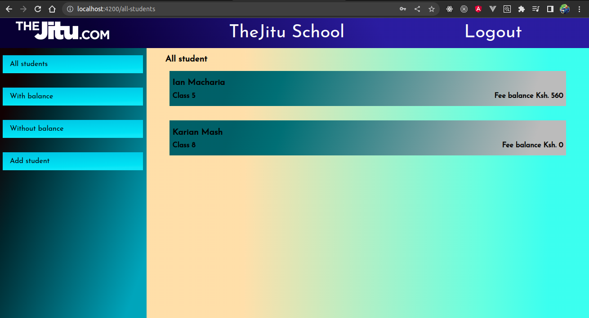
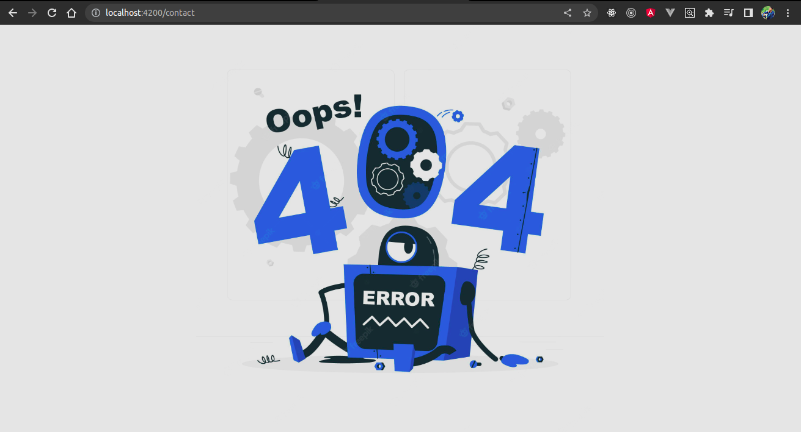

# jitu-school-fees-managemnet

A simple school fees management system in Angular

## Features
    - Login as admin
    - View students with balance
    - View students without balance
    - Add students (name, primary school class they are in and the balance they have)
    - Logout from the system
    - Implement guards to protect routes if admin is not logged in
    - 404 page if invalid path url is entered
    - Redirect to home page if not logged in

## Home page

This is the landing page

## Login page
If you enter invalid email or password, show error message

## Dashboard page
Initially the dashboard shows a fallback component because there are no students in the system yet.

## Students with balance page
Filter students with balance of more than 0

## Students without balance page
Show students with balance of 0 here

## All students page
Display all students here

## 404 page
If you navigate to invalid url route, this 404 page will display.

